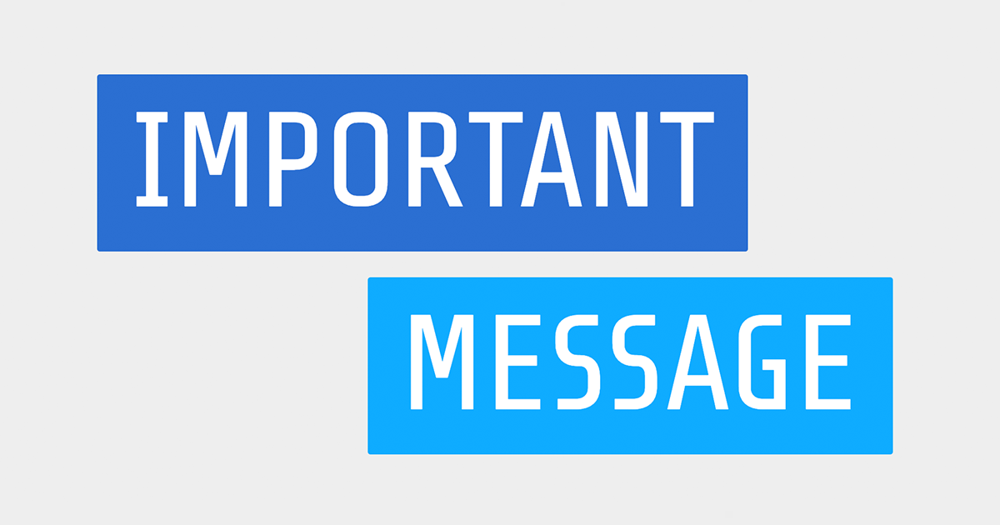

# Important Message 📣📣📣

Send _"important"_ messages to your friends, family and colleagues in the of style the Victorian Government's coronavirus announcement messages.

### [Create a presentation 👨‍🎨](https://important-message.netlify.app/)



Made with hastily and hackily while learning [Svelte](https://svelte.dev/).

## Developing

Once you've created a project and installed dependencies with `npm install` (or `npm install` or `yarn`), start a development server:

```bash
npm run dev

# or start the server and open the app in a new browser tab
npm run dev -- --open
```

## Building

Before creating a production version of your app, install an [adapter](https://kit.svelte.dev/docs#adapters) for your target environment. Then:

```bash
npm run build
```

> You can preview the built app with `npm run preview`, regardless of whether you installed an adapter. This should _not_ be used to serve your app in production.

## Deploy

Deployed with Github actions to [Netlify](https://important-message.netlify.app/).

## Disclaimer

It feels stupid saying it but to be 100% clear this is not endorsed by the Victorian Government in any way. Be cool.

> I trust all Victorians will do the right thing.

_Daniel Andrews, circa 2020-2021_
